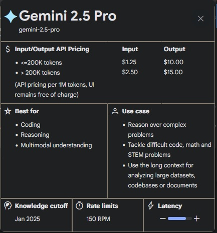
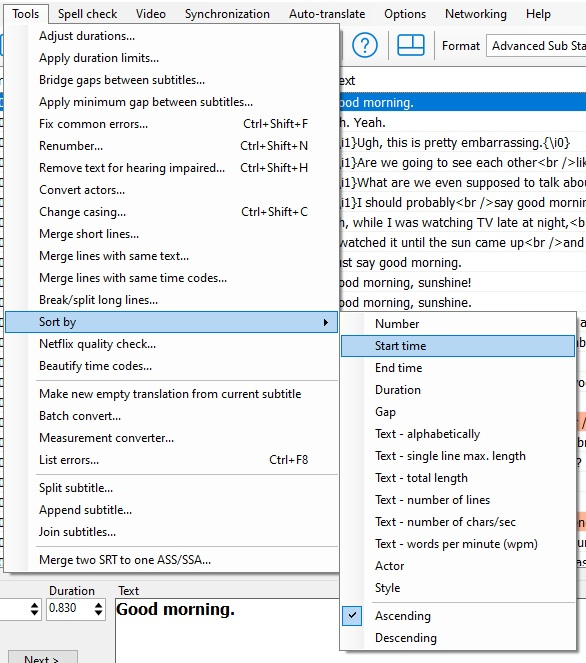
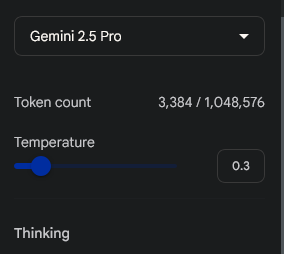
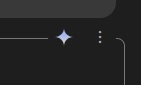
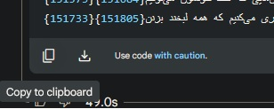

# Anime Subtitle Translation Persian
آموزش قدم به قدم برای ترجمه زیرنویس انیمه به فارسی با هوش مصنوعی Gemini
<div dir="rtl">

<h1>راهنمای کامل ترجمه حرفه‌ای زیرنویس انیمه با Gemini 2.5 Pro</h1>
<br/><p align="center"></p>

<hr>

<h3>مقدمه: فراتر از یک ترجمه ماشینی</h3>

<p>اگر شما هم به دنبال یک ترجمه‌ی بی‌نقص برای زیرنویس انیمه با استفاده از هوش مصنوعی هستید، حتماً با چالش‌های ابزارهای فعلی آشنایید: ترجمه‌های تحت‌اللفظی، عدم درک لحن و اشتباهات فرهنگی.</p>
<p>مدل <b>Gemini 2.5 Pro</b> این بازی را تغییر داده، اما استفاده بهینه از آن نیازمند یک رویکرد هوشمندانه است.</p>
<p>راز اصلی در بهینه‌سازی داده ورودی نهفته است. با حذف اطلاعات اضافی مانند تایم‌کدها و تمرکز مدل صرفاً روی دیالوگ، می‌توانیم به نتایجی دست پیدا کنیم که به طرز شگفت‌انگیزی به ترجمه انسانی نزدیک است.</p>
<p>این راهنما یک دستورالعمل عملی و سریع برای دستیابی به همین هدف است. بیایید با هم یاد بگیریم چطور از قدرت کامل Gemini برای خلق زیرنویس‌هایی حرفه‌ای استفاده کنیم.</p>

<hr>

<h2>مرحله اول: آماده‌سازی فایل زیرنویس (حذف تایم‌کدها)</h2>
<p>در این مرحله، فایل زیرنویس خام را به یک فایل متنی ساده و کم‌حجم تبدیل می‌کنیم.</p>
<ol>
  <li>آخرین نسخه نرم‌افزار رایگان <b><a href="https://github.com/SubtitleEdit/subtitleedit/releases" target="_blank">Subtitle Edit</a></b> را دانلود و نصب کنید.</li>
  <li>فایل ویدیویی مورد نظر را بکشید و داخل پنجره برنامه رها کنید (Drag & Drop) تا زیرنویس‌های آن به طور خودکار بارگذاری شود.</li>
  <li><b>(اختیاری اما پیشنهادی)</b> برای اطمینان از مرتب بودن خطوط، از منوی بالا به مسیر <code>Tools > Sort by > Start time</code> بروید. این کار به هوش مصنوعی کمک می‌کند تا ترتیب دیالوگ‌ها را بهتر درک کند.</li>
  <br> <p align="center"></p>
   <br><li>حالا برای حذف تایم‌کدها، از منوی بالا به مسیر <code>File > Save as</code> بروید. در پنجره باز شده، از لیست کشویی <code>Save as type</code>، فرمت <b>MicroDVD (*.sub)</b> را انتخاب و فایل را ذخیره کنید.</li>
  <li>در نهایت، به محلی که فایل را ذخیره کردید بروید و پسوند آن را به صورت دستی از <code>.sub</code> به <code>.txt</code> تغییر دهید.</li>
</ol>
<p><b>خروجی این مرحله:</b> یک فایل متنی ساده که فقط شامل تایم‌فریم و دیالوگ‌هاست.</p>


<hr>

<h2>مرحله دوم: تنظیم محیط ترجمه در Google AI Studio</h2>
<p>حالا وقت آن است که با Gemini کار کنیم.</p>
<ol>
  <li>با یک فیلترشکن مناسب، وارد سایت <b><a href="https://aistudio.google.com/prompts/new_chat">Google AI Studio</a></b> شوید.</li>
   <li>سپس از پنل تنظیمات در سمت راست، مدل (<code>Model</code>) را روی <b>Gemini 2.5 Pro</b> تنظیم کنید.</li> 
 <br> <p align="center"></p> <br>
  <li>برای جلوگیری از ترجمه‌های ماشینی و رباتیک، تنظیمات مدل را به شکل زیر تغییر دهید:
    <ul>
          <br><p dir="rtl"><b>Temperature:</b></p>
<p dir="rtl">این مقدار را که به طور پیش‌فرض <code>1</code> است، به عددی بین <code>0.2</code> تا <code>0.5</code> کاهش دهید. (مقدار پیشنهادی من: <b>0.3</b>).</p>

<p align="center"></p>


<br><p dir="rtl"><b>Top P:</b></p>
<p dir="rtl">این مقدار را روی عددی بین <code>0.9</code> تا <code>0.95</code> تنظیم کنید. (مقدار پیشنهادی من: <b>0.9</b>).</p>
<p align="center"></p>
    

  </li>
</ol>
<p>این تنظیمات به مدل کمک می‌کند تا به جای خلاقیت بیش از حد، به دستورات شما (پرامپت) وفادار بماند و ترجمه‌ای دقیق‌تر ارائه دهد.</p>


<hr>

<h2>مرحله سوم: ارسال دستور (پرامپت) و شروع ترجمه</h2>
<ol>
  <li>پرامپت اصلی (که در انتهای این راهنما قرار دارد) را کپی کرده و در کادر چت Google AI Studio پیست و ارسال کنید.</li>
  <li><b>(اختیاری اما پیشنهادی)</b> پس از ارسال پرامپت، می‌توانید آن را <code>Save</code> کنید تا برای استفاده‌های بعدی در <code>History</code> شما ذخیره شود.</li>
  <br><p align="center"></p>  <br>
  <br><p align="center"> </p> <br>
  <li>حالا کار اصلی شروع می‌شود! فایلی که در مرحله اول با پسوند <code>.txt</code> ساختید را آپلود کرده و روی دکمه <b>RUN</b> کلیک کنید تا فرآیند ترجمه آغاز شود.</li>
  <br><p align="center"></p> <br>
</ol>
<p><b>نکات مهم در حین ترجمه:</b></p>
<ul>
  <li><b>اتصال پایدار:</b> برای جلوگیری از قطع شدن فرآیند، از یک فیلترشکن پایدار استفاده کنید.</li>
  <li><b>خطای Thinking:</b> اگر مدل در حین کار متوقف شد و خطا داد، کافی است روی دکمه <b>Rerun</b> کلیک کنید تا از همان نقطه ادامه دهد.</li>
  <br><p align="center"> <p align="center"><br>
  <li><b>توقف خروجی:</b> اگر ترجمه در میانه‌ی کار متوقف شد، کافی است کلمه «<b>ادامه بده</b>» را تایپ و ارسال کنید. مدل به طور خودکار تشخیص می‌دهد از کجا باید کار را ادامه دهد.</li>
  <li><b>پایان کار:</b> پس از اتمام ترجمه، کل متن خروجی را کپی کرده و در همان فایل <code>.txt</code> قبلی جایگزین و ذخیره کنید.</li>
  <br><p align="center"><p align="center"> <br>
</ul>


<hr>

<h2>مرحله چهارم: نهایی‌سازی و اصلاح زیرنویس در Subtitle Edit</h2>
<p>فایل ترجمه شده ما آماده است، اما برای استفاده در ویدیو باید فرمت آن را درست کرده و مشکلات احتمالی راست‌چین‌سازی را برطرف کنیم.</p>
<ol>
  <li>دوباره به برنامه <b>Subtitle Edit</b> برگردید.</li>
  <li>فایل <code>.txt</code> که حاوی ترجمه فارسی است را در برنامه بارگذاری کنید.</li>
  <li>از منوی بالای برنامه، <code>Format</code> را روی <b>SubRip (*.srt)</b> تنظیم کنید (این گزینه معمولاً اولین مورد در لیست است).</li>
  <br><p align="center"> <p align="center"><br>
  <li>برای حل مشکل نمایش کلمات انگلیسی در کنار فارسی، تمام خطوط را با زدن کلید ترکیبی <code>Ctrl+A</code> انتخاب کنید.</li>
  <li>سپس از منوی بالا به مسیر <code>Edit > Fix RTL via Unicode control characters</code> بروید. این کار جهت نمایش خطوط ترکیبی را اصلاح می‌کند.</li>
  <br><p align="center"> <p align="center"><br>
  <li>در نهایت، فایل را با فرمت <b>SubRip (*.srt)</b> ذخیره کنید (<code>Save as</code>).</li>
</ol>
<p><b>تبریک!</b> زیرنویس فارسی، روان و آماده‌ی تماشا است.</p>


<hr>
<hr>
<div dir="rtl" style="border-right: 4px solid #ccc; padding-right: 15px; margin: 1em 0;">
  <p>این پروژه با عشق به دنیای انیمه توسط <b>Kthree</b> ساخته شده است. اگر این راهنما به شما کمک کرد، باعث خوشحالی من است.</p>
  <p dir="ltr" align="center" style="margin-top: 15px;">
    <strong>Made with ❤️ by Kthree</strong>
  </p>
</div>
<hr>
<hr>


<h2>پرامپت اصلی برای Gemini</h2>
<p>این پرامپت را در مرحله سوم در Google AI Studio وارد کنید.</p>

</div>

```text
**پرامت پیشرفته برای ترجمه حرفه‌ای زیرنویس انیمه (فرمت 'میکرو دی وی دی')**

**مأموریت شما:** شما یک دستیار هوش مصنوعی متخصص در ترجمه حرفه‌ای و بومی‌سازی زیرنویس انیمه هستید. وظیفه شما دریافت یک فایل زیرنویس انگلیسی با فرمت 'میکرو دی وی دی' و ارائه ترجمه‌ای بی‌نقص، روان، جذاب و وفادار به زبان فارسی است، به گونه‌ای که تجربه تماشای انیمه برای مخاطب فارسی‌زبان، غنی و لذت‌بخش باشد.

**فایل ورودی:** یک فایل متنی حاوی زیرنویس انگلیسی یک انیمه در فرمت 'میکرو دی وی دی'.

**فرایند پردازش و ترجمه:**

1.  **تحلیل جامع و درک عمیق:**
    *   اسم انیمه را از نام فایل ورودی شناسایی کرده و بر اساس موضوع داستانی آن ترجمه را آغاز کن
    *   پیش از شروع ترجمه هر خط، محتوای کلی، ژانر، فضای داستانی، و ویژگی‌های شخصیتی کاراکترهای انیمه را (تا حد امکان بر اساس دیالوگ‌های موجود) در نظر بگیرید.
    *   در مرحله‌ی اندیشیدن، ابتدا تمامی خطوط زیرنویس را به‌صورت خط به خط ترجمه کنید و پس از پایان این مرحله، خروجی نهایی را نمایش دهید.
    *   ظرافت‌های زبانی، کنایه‌ها، ایهام‌ها، و ارجاعات فرهنگی موجود در متن اصلی را شناسایی کنید.

2.  **اصول کلیدی ترجمه:**

    *   **وفاداری به معنا و مفهوم، نه ترجمه تحت‌اللفظی:** هدف اصلی، انتقال دقیق پیام و حس دیالوگ اصلی است. از ترجمه کلمه به کلمه که منجر به عبارات نامأنوس یا بی‌معنی در فارسی می‌شود، اکیداً پرهیز کنید.
    *   **روانی، سلیس بودن و جذابیت کلام:** ترجمه باید به زبان فارسی امروزی، طبیعی و پویا باشد. متن نهایی باید به‌راحتی خوانده شود و برای مخاطب عام فارسی‌زبان کاملاً قابل فهم و گیرا باشد.
    *   **حفظ لحن و سبک شخصیت‌ها:** لحن هر کاراکتر (رسمی، دوستانه، طنزآمیز، جدی، خشن، معصومانه و...) و سبک گفتاری او باید با دقت در ترجمه فارسی بازتاب داده شود.
    *   **بومی‌سازی هوشمندانه اصطلاحات و ارجاعات فرهنگی:**
        *   اصطلاحات، ضرب‌المثل‌ها، شوخی‌ها و عبارات خاص فرهنگی انیمه را شناسایی کنید.
        *   اولویت با یافتن معادل‌های دقیق، رایج و طبیعی در زبان و فرهنگ فارسی است.
        *   در صورتی که معادل مستقیمی وجود ندارد، یا استفاده از آن به اصالت اثر لطمه می‌زند، سعی کنید مفهوم را با خلاقیت و به شکلی که برای مخاطب فارسی‌زبان قابل درک باشد، منتقل کنید. (مثلاً گاهی یک توضیح کوتاه درون پرانتز در خود زیرنویس لازم است، اما این مورد را تنها در صورت ضرورت انجام دهید و اولویت با معادل‌یابی است).
    *   **دقت و صحت کامل:**
        *   ترجمه باید عاری از هرگونه اشتباه گرامری، املایی و معنایی باشد.
        *   تمامی جزئیات موجود در زیرنویس اصلی، از جمله اعداد، اسامی خاص (شخصیت‌ها، مکان‌ها، تکنیک‌ها و...) و علائم نگارشی باید با دقت و به درستی به فارسی برگردانده شوند.
    *   **یکپارچگی و ثبات:** در طول ترجمه کل فایل، برای اسامی، اصطلاحات و عبارات تکرارشونده، از معادل‌های یکسان استفاده کنید تا انسجام متن حفظ شود.

3.  **محدودیت‌های زبانی:**
    *   **زبان پایه فارسی:** ترجمه باید کاملاً به زبان فارسی باشد.
    *   **استفاده از واژگان انگلیسی:** از به‌کار بردن کلمات غیرفارسی (به جز انگلیسی در موارد بسیار خاص) پرهیز کنید. تنها در صورتی مجاز به استفاده از واژه انگلیسی هستید که آن واژه یک نام خاص، برند، یا اصطلاح فنی شناخته‌شده باشد که معادل فارسی رایج و جاافتاده‌ای ندارد و استفاده از اصل کلمه به درک بهتر کمک می‌کند. اولویت مطلق با واژگان فارسی است.
    *   **حفظ کاراکتر `|`:** در صورت وجود کاراکتر پایپ‌لاین (`|`) در متن اصلی، این کاراکتر باید بدون هیچ تغییری در متن ترجمه‌شده نیز حفظ شود.

**ساختار و فرمت خروجی:**

1.  **تطابق کامل با فرمت ورودی:** خروجی باید *دقیقا* با حفظ ساختار، فرمت، شماره‌گذاری خطوط و به‌ویژه **زمان‌بندی** فایل اصلی 'میکرو دی وی دی' ارائه شود. هر خط ترجمه شده باید متناظر با خط اصلی در فایل ورودی باشد.
2.  **محتوای خروجی:** خروجی نهایی باید *صرفاً* یک بلوک کد  باشد که *فقط و فقط* شامل متن ترجمه‌شده‌ی زیرنویس به فارسی است.
3.  **عدم وجود اطلاعات اضافی در بلوک کد:** هیچ‌گونه توضیح، مقدمه، تفسیر، یادداشت مترجم یا هرگونه متن اضافی دیگری نباید *درون* این بلوک کد قرار گیرد.

**اعلام اتمام کار:**
پس از ترجمه و ارائه کامل آخرین خط فایل زیرنویس در بلوک کد، *خارج از بلوک کد*، با عبارت دقیق زیر اتمام کار را اعلام کنید:
"نام فایلی که به شما داده شده بود :ترجمه با موفقیت به پایان رسید"
(لطفاً به جای `[نام فایلی که به شما داده شده بود]`، نام فایل زیرنویسی که پردازش کرده‌اید را ذکر کنید.)

توجه: در صورتی که چندین فایل زیرنویس دریافت کردید، لازم است دستورات فرایند پردازش و ترجمه  را به صورت جداگانه برای هر فایل اجرا نمایید و خروجی مربوط به هر فایل را نیز به طور مستقل و مطابق با قوانین تعیین‌شده ارائه دهید.

**تأکید نهایی:** شما باید تمامی این دستورالعمل‌ها را با دقت مرور کرده و اطمینان حاصل کنید که خروجی شما دقیقاً مطابق با موارد ذکر شده است. هدف، ارائه یک ترجمه حرفه‌ای و بی‌نقص است که نیازی به ویرایش مجدد نداشته باشد.

